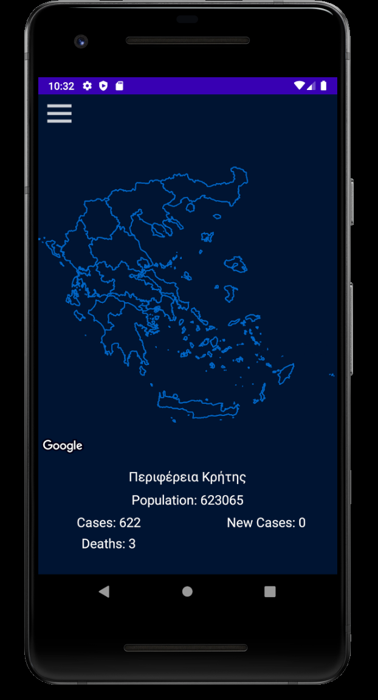
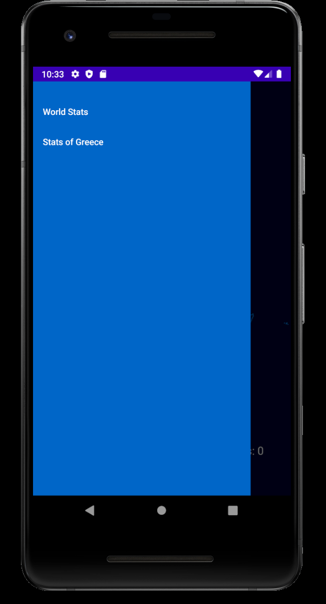
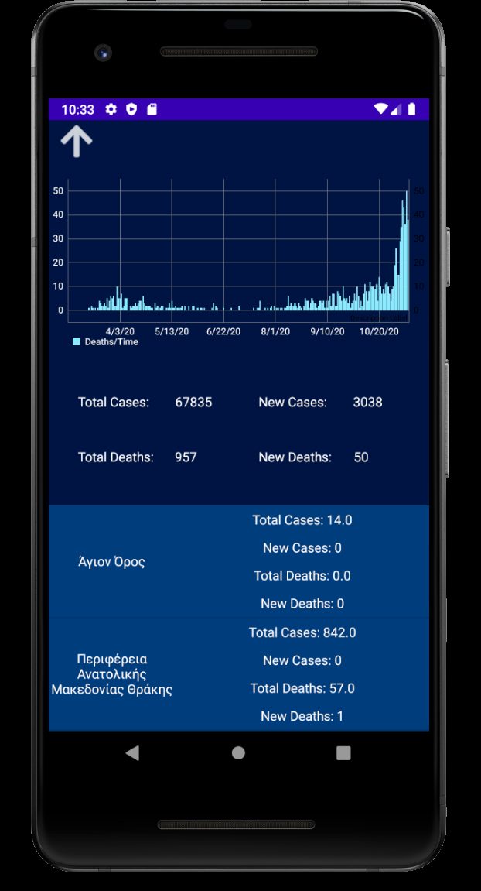
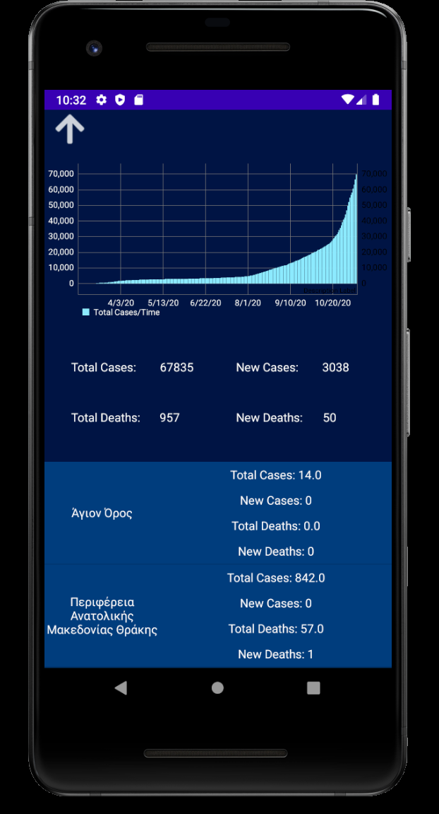
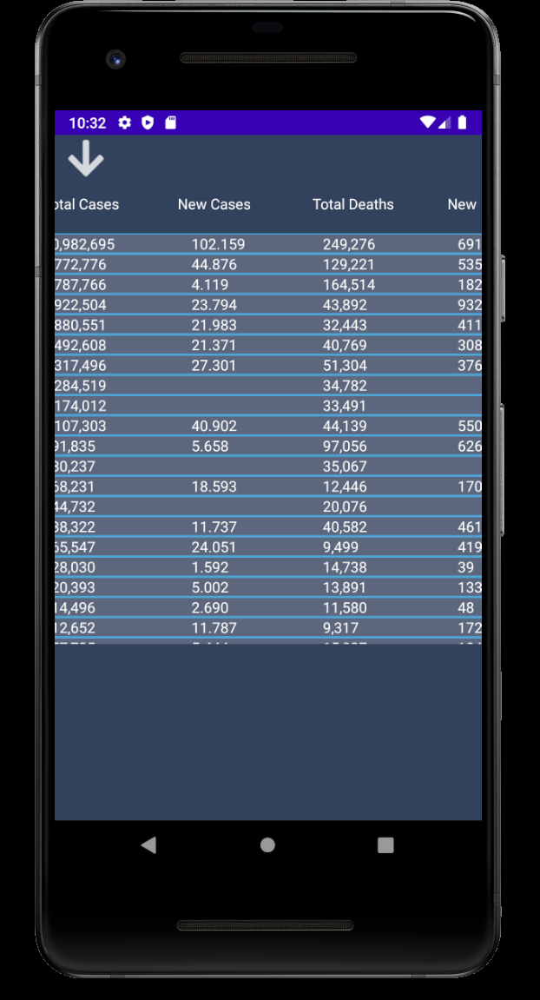
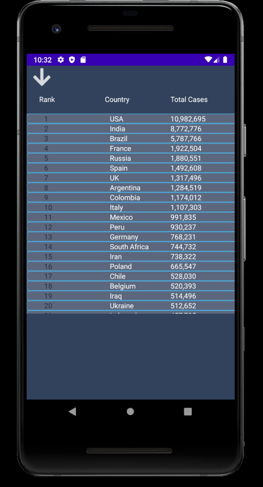

# COVIDInfoGR
A small informative application about the status of COVID-19 Pandemic in Greece

This application is a simple illustration of the data taken from iMEdD (https://github.com/iMEdD-Lab/open-data). 
We also used MPAndroidChart in order to make some diagrams. There are still some bugs in this version but nothing major and hopefully we will resolve them in the near future.

Also, implemented some swipe-top and swipe-bottom gestures to make navigation a bit faster. 

Screenshots: 

The main screen with an interactive map of Greece. By touching each region the name of the area, population, total cases, new cases, total deaths and new deaths appear right bellow the map. (In the screenshot Crete was tapped)

We added a slider, accessible from the main activity to make navigation easier (and maybe add some more options in the future).

 

By sliding down (or by selecting Stats of Greece from the slider) we get to this activity, where there are information about each area seperetaly and some 3 graphs on the top showing information about the cases and deaths per time. 

 

By sliding up (or by selecting World Stats from the slider) we get to the world wide stats. We implemented a recycler view to show all these data without crashes and we have vertical and horizontal scroll. 

Feel free to use any part of the code. If you have any thoughts or recommendations about the code or the project in general, let us know.

-Nick Georgedakis

-Mike Ladas 
